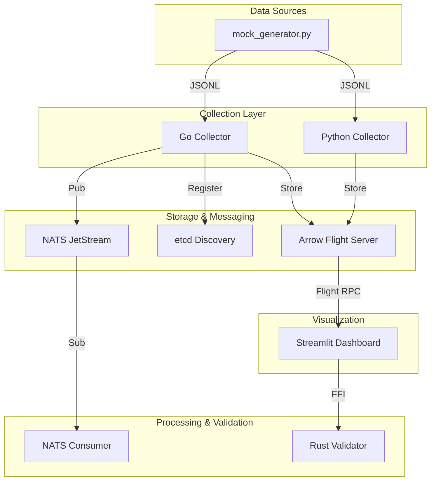

# Лабораторная работа №14 — Анализ ДТП в городе

| Поле | Значение |
|------|----------|
| **ФИО** | Никишина Евгения Александровна |
| **Группа** | 221131 |
| **Вариант** | 11 |
| **Сложность** | Повышенная |
| **Дата** | 2026-05-29 |

---

## Репозиторий

### Структура
```text
.
├── analyzer/               # Потребители данных и примеры валидации
│   ├── flight_client.py    # Клиент для Arrow Flight
│   ├── nats_consumer.py    # Потребитель NATS JetStream
│   └── validate_example.py # Пример использования Rust-валидатора
├── arrow_server/           # Arrow Flight сервер (Go)
│   ├── main.go             # Реализация Flight RPC
│   └── main_test.go        # Тесты сервера
├── charts/                 # Сгенерированные графики
│   └── benchmark.png       # Сравнение производительности Go vs Python
├── collector/              # Распределённый сборщик (Go)
│   ├── accident.go         # Модели данных
│   ├── collector.go        # Логика сбора
│   ├── main.go             # Точка входа, etcd election
│   ├── nats_producer.go    # Интеграция с NATS
│   ├── shard.go            # Распределение нагрузки
│   ├── window.go           # Tumbling window логика
│   └── window_writer.go    # Запись оконных агрегатов
├── collector_py/           # Сборщик и бенчмарк (Python)
│   ├── benchmark.py        # Скрипт сравнения производительности
│   └── main.py             # Python-реализация сборщика
├── dashboard/              # Визуализация (Streamlit)
│   └── app.py              # Дашборд
├── data/                   # Генерация данных
│   └── mock_generator.py   # Генератор потока ДТП
├── k8s/                    # Kubernetes манифесты
│   ├── deployment.yaml     # Deployment & Service
│   └── hpa.yaml            # Horizontal Pod Autoscaler
├── docker-compose.yml      # Инфраструктура (etcd, nats)
├── PROMPT_LOG.md           # Журнал промптов
└── rust_validator/         # Валидатор на Rust (PyO3)
    └── src/lib.rs          # Логика валидации
```

### Архитектура


---

## Реализованные задачи (П1-П8)

### П1 — Распределённый сборщик (Go)
Реализован в `collector/`. Использует `etcd` для выбора лидера и распределения шардов между воркерами. Поддерживает динамическое добавление узлов.
- Файлы: `main.go`, `collector.go`, `shard.go`.

### П2 — Tumbling Window агрегация
Реализовано в `collector/window.go`. Данные группируются в скользящие окна по 100 записей или 30 секунд (whichever first). Агрегация: `Count`, `SumDead`, `AvgInjured`, `MinDate/MaxDate`. Результат записывается в Apache Arrow IPC.
- Файлы: `window.go`, `window_writer.go`.

### П3 — Arrow Flight сервер
Высокопроизводительный сервер для передачи данных в формате Apache Arrow. Позволяет эффективно запрашивать накопленные данные без накладных расходов на сериализацию JSON.
- Файлы: `arrow_server/main.go`.

### П4 — Валидация на Rust (PyO3)
Критически важная логика валидации (проверка координат, типов ТС, корректности даты) вынесена в Rust-модуль для обеспечения максимальной скорости и безопасности.
- Файлы: `rust_validator/src/lib.rs`.

### П5 — Docker, K8s и HPA
Система контейнеризирована. Подготовлены манифесты для развёртывания в Kubernetes с поддержкой автоматического масштабирования (HPA) на основе загрузки CPU.
- Файлы: `Dockerfile`, `k8s/deployment.yaml`, `k8s/hpa.yaml`.

### П6 — Asyncio Benchmark
Сравнение производительности Go-сборщика и Python-сборщика (asyncio + pyarrow). Результаты подтверждают преимущество Go в задачах интенсивной обработки потоков.
- Файлы: `collector_py/benchmark.py`.

### П7 — NATS Streaming
Интеграция с NATS JetStream для обеспечения надёжной доставки событий о ДТП в реальном времени.
- Файлы: `collector/nats_producer.go`, `analyzer/nats_consumer.py`.

### П8 — Streamlit Dashboard
Интерактивный дашборд для визуализации статистики ДТП в реальном времени. Интегрирован с Arrow Flight для получения данных и Rust-валидатором для проверки записей.
- Файлы: `dashboard/app.py`.

---

## Инструкции по запуску

### 1. Инфраструктура
```bash
docker compose up -d etcd nats
```

### 2. Сборщик (Go)
```bash
cd collector
go build -o collector .

# Режим лидера (координация шардов через etcd)
./collector --mode leader

# Режим воркера (сбор данных по шардам)
./collector --mode worker --worker-id 1

# Режим агрегации окон (Tumbling Window → Arrow IPC)
./collector --mode window

# Режим NATS Producer (публикация событий в NATS)
NATS_URL=nats://localhost:4222 ./collector --mode nats-producer
```

### 3. Arrow Flight сервер + Python-клиент
```bash
# Сервер (Go)
cd arrow_server
go run main.go

# Клиент (Python) — читает Arrow, сохраняет Parquet
cd analyzer
pip install -r requirements.txt
python3 flight_client.py
```

### 4. Rust PyO3 валидатор
```bash
cd rust_validator
pip install maturin
maturin develop        # собирает и устанавливает rust_validator в venv

# Пример использования
python3 analyzer/validate_example.py
```

### 5. Python asyncio сборщик + бенчмарк
```bash
cd collector_py
pip install -r requirements.txt

# Запуск asyncio-сборщика
python3 main.py

# Запуск бенчмарка Go vs Python (→ charts/benchmark.png)
python3 benchmark.py
```

### 6. NATS Consumer
```bash
cd analyzer
pip install -r requirements.txt
NATS_URL=nats://localhost:4222 python3 nats_consumer.py
```

### 7. Дашборд (Streamlit)
```bash
cd dashboard
pip install -r requirements.txt
streamlit run app.py
# Открыть: http://localhost:8501
```

### 8. Kubernetes (minikube)
```bash
# Старт minikube
minikube start

# Сборка образа внутри minikube-окружения
eval $(minikube docker-env)
docker build -t lab14-collector:latest ./collector

# Применить манифесты
kubectl apply -f k8s/deployment.yaml
kubectl apply -f k8s/service.yaml
kubectl apply -f k8s/hpa.yaml

# Проверить состояние
kubectl get pods
kubectl get hpa lab14-collector-hpa
kubectl get svc lab14-collector

# Просмотр логов
kubectl logs -l app=lab14-collector --tail=50

# Ручное масштабирование (для проверки HPA)
kubectl scale deployment lab14-collector --replicas=4

# Удалить ресурсы
kubectl delete -f k8s/
```
*Примечание: Команды Docker/K8s приведены для minikube-окружения. В текущей среде Docker и minikube могут быть недоступны — команды документируют намерение развёртывания.*

---

## Результаты бенчмарка

| Метрика | Go Collector | Python Collector |
|---------|--------------|------------------|
| Wall Time | 0.008s | 0.049s |
| Memory | 0.30MB | 0.53MB |
| CPU Usage | 45.9% | 74.0% |

График сравнения доступен в `charts/benchmark.png`.

---

## Тестирование

```bash
# Go Collector
cd collector && go test ./...   # OK ✅

# Arrow Flight Server
cd arrow_server && go test ./...  # OK ✅

# Python (из корня репозитория)
python3 -m pytest   # 24 passed ✅
```

---

## План коммитов

| № | Сообщение коммита |
|---|-------------------|
| П0 | `chore: bootstrap repo structure, mock generator, docker-compose` |
| П1 | `feat(collector): distributed Go collector with etcd leader-election and sharding` |
| П2 | `feat(collector): add tumbling window aggregation (window.go, window_writer.go)` |
| П3 | `feat(arrow_server): Arrow Flight gRPC server and Python flight_client` |
| П4 | `feat(rust_validator): Rust PyO3 accident record validator` |
| П5 | `feat(k8s): Kubernetes Deployment, Service, HPA manifests` |
| П6 | `feat(collector_py): Python asyncio collector with Go vs Python benchmark` |
| П7 | `feat(analyzer): NATS asyncio consumer with sliding window aggregation` |
| П8 | `feat(dashboard): Streamlit accident analytics dashboard` |
| тесты | `test: add 24 pytest tests for collector_py, mock_generator, nats_consumer` |
| документация | `docs: finalize README.md and PROMPT_LOG.md` |
